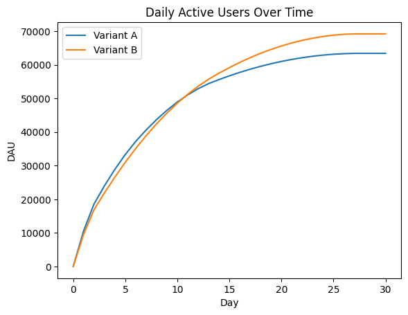
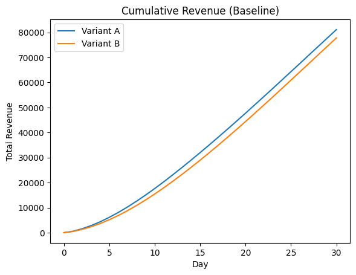
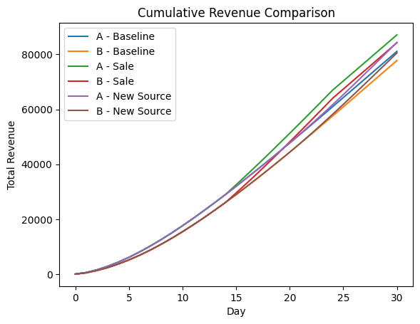
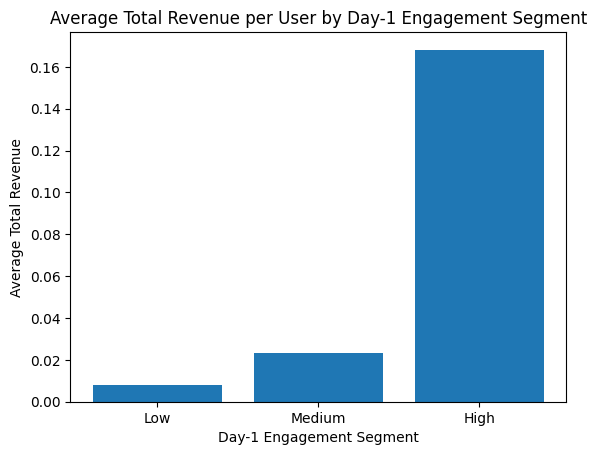
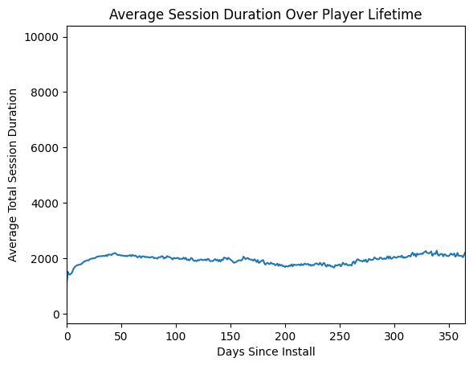

# Vertigo Games – Data Analyst Case Study

This repository contains my solution for the Vertigo Games Data Analyst case study.

---

## Structure
- Task 1: A/B test modeling and simulation
- Task 2: Exploratory data analysis

---

## Task 1 – A/B Test Modeling

In Task 1, two product variants (A and B) were modeled using assumptions around retention, monetization, and ad behavior.

**Key conclusions:**
- Variant B consistently shows higher Daily Active Users (DAU) in the end.
- Variant A generates higher total revenue at both Day 15 and Day 30 due to stronger ad monetization efficiency.
- A temporary 10-day sale increases revenue more effectively than introducing a new user acquisition source.
- Across all tested scenarios, Variant A remains the revenue-optimal choice.

**Visualizations (3):**
1. Daily Active Users over time

2. Baseline cumulative revenue comparison

3. Revenue comparison across scenarios (baseline, sale, new user source)

---

## Task 2 – Exploratory Data Analysis & User Segmentation

Task 2 focuses on understanding player behavior patterns using real gameplay and monetization data.

**Key conclusions:**
- Day-1 engagement (measured via session duration) is a strong predictor of long-term activity and monetization.
- Session duration increases during the early lifecycle and stabilizes after ~20 days, indicating a learning and onboarding phase.
- High Day-1 engagement users generate significantly higher average revenue, with monetization showing a highly right-skewed distribution.

**Visualizations (3):**
1. Revenue by Day-1 engagement segment

2. Average session duration trend over time

3. Revenue distribution across engagement segments

---

## Final Takeaway

Early user engagement is the strongest lever for both retention and revenue. While higher DAU is valuable, monetization efficiency and early engagement quality ultimately drive business outcomes.